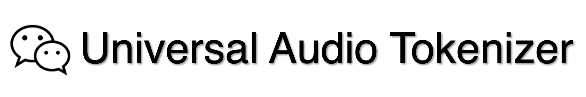
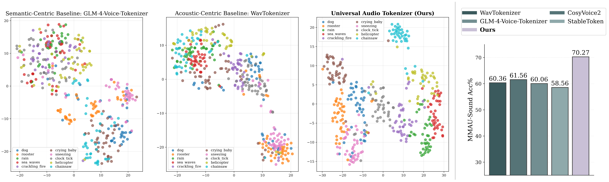

<div align="center">

</div>

<h1 align="center"><b>Universal Audio Tokenizer</b></h1>

<h3 align="center">
<b>Empowering Semantic Speech Tokenizers with General Audio Perception</b>
</h3>

<h3 align="center">
  WeChat AI</b>
</h3>

<br>

<!-- Badges -->
<p align="center">
<a href="https://arxiv.org/abs/2605.31521"></a>
&nbsp;
<a href="https://huggingface.co/tencent/Universal_Audio_Tokenizer"></a>
&nbsp;
<a href="LICENSE"></a>
</p>

<br>

<!-- Highlight Box -->
<table>
<tr>
<td>

<p align="center">
  <table>
    <tr>
      <th>Model</th>
      <th>Single Codebook</th>
      <th>General Audio</th>
      <th>Linguistic Alignment</th>
    </tr>
    <tr>
      <td><a href="https://github.com/facebookresearch/encodec">EnCodec</a></td>
      <td align="center">❌</td>
      <td align="center">✅</td>
      <td align="center">❌</td>
    </tr>
    <tr>
      <td><a href="https://github.com/ZhangXInFD/SpeechTokenizer/">SpeechTokenizer</a></td>
      <td align="center">❌</td>
      <td align="center">✅</td>
      <td align="center">✅</td>
    </tr>
    <tr>
      <td><a href="https://github.com/FunAudioLLM/CosyVoice">CosyVoice2</a></td>
      <td align="center">✅</td>
      <td align="center">❌</td>
      <td align="center">✅</td>
    </tr>
    <tr>
      <td><a href="https://github.com/zai-org/GLM-4-Voice">GLM-4-Voice-Tokenizer</a></td>
      <td align="center">✅</td>
      <td align="center">❌</td>
      <td align="center">✅</td>
    </tr>
    <tr>
      <td><a href="https://github.com/Tencent/StableToken">StableToken</a></td>
      <td align="center">✅</td>
      <td align="center">❌</td>
      <td align="center">✅</td>
    </tr>
    <tr>
      <td><a href="https://github.com/jishengpeng/WavTokenizer">WavTokenizer</a></td>
      <td align="center">✅</td>
      <td align="center">✅</td>
      <td align="center">❌</td>
    </tr>
    <tr>
      <td><b>Universal Audio Tokenizer (Ours)</b></td>
      <td align="center">✅</td>
      <td align="center">✅</td>
      <td align="center">✅</td>
    </tr>
  </table>
</p>

<h3>⭐️ Universal Audio Tokenizer uniquely combines compact single-codebook modeling, general audio perception, and linguistic alignment. </h3>



</td>
</tr>
</table>

<!-- News -->
## 📢 News

| Date | News |
|:-----|:-------|
| **2026-06-01** | 🚀 Initial release of Universal Audio Tokenizer on [GitHub](https://github.com/Tencent/Universal_Audio_Tokenizer) and [HuggingFace](https://huggingface.co/tencent/Universal_Audio_Tokenizer)! |

<br>

## 💡 Highlights

Existing semantic speech tokenizers often suffer from *acoustic blindness*, while acoustic tokenizers typically lack *linguistic alignment*.

Universal Audio Tokenizer bridges this gap through:
-   🧩 **Semantic-Acoustic Primitives (SAP) supervision** that decomposes raw audio into fundamental linguistic content, vocal attributes, and auditory-scene primitives
-   ⚖️ **Semantic-Acoustic Equilibrium (SAE) mechanism** that adaptively injects fine-grained acoustic details from shallow encoder layers into deep semantic streams

This results in a compact single-codebook audio tokenizer that **simultaneously** enables:
*   🧠 **Seamless LLM Integration**: A unified audio input/output interface in Audio-LLMs
*   🗣️ **Linguistic Alignment**: Superior performance on speech reconstruction and TTS synthesis tasks
*   🎯 **General Audio Perception**: Discriminative representations for diverse audio events and strong performance on downstream audio understanding benchmarks

<br>

<!-- ## Repository Layout

```text
configs/            Example training configs
data/               Dataset list files and related assets
example_usage.py    Inference demo for tokenization and reconstruction
src/model/          Model, configuration, and generation code
src/train/          Training, collator, dataset, dataloader, and metrics code
checkpoints/        Saved checkpoints
reconstruction/     Reconstructed audio outputs
``` -->

## 🚀 Quick Start

### Installation

```bash
# 1. Clone the repository with all submodules
git clone --recursive https://github.com/Tencent/Universal_Audio_Tokenizer.git
cd Universal_Audio_Tokenizer

# If you have already cloned the repository without --recursive,
# initialize submodules with:
git submodule update --init --recursive

# 2. Create a conda environment
conda create -n universal-audio-tokenizer python=3.10.13 -y
conda activate universal-audio-tokenizer

# 3. Install dependencies
conda install -c conda-forge libsndfile -y
pip install -r requirements.txt
```

### Download Pretrained Checkpoints

Using `huggingface-cli`:

```bash
huggingface-cli download tencent/Universal_Audio_Tokenizer \
  --local-dir checkpoints/Universal_Audio_Tokenizer
```

Or using Python:

```python
from huggingface_hub import snapshot_download

snapshot_download(
    repo_id="tencent/Universal_Audio_Tokenizer", 
    local_dir="checkpoints/Universal_Audio_Tokenizer"
)
```

### Run Inference

We provide a simple inference demo in `example_usage.py`.

```bash
python example_usage.py \
  --device auto \
  --model_path checkpoints/Universal_Audio_Tokenizer \
  --audio_path /path/to/audio.wav
```

The script will:

- load the tokenizer and feature extractor;
- extract discrete audio tokens from input audio clips;
- reconstruct waveforms from the tokens and save reconstructed audio under `reconstruction/`.

## 🔥 Training

Training and evaluation are implemented in `src/train/` and launched with `scripts/train.sh`.

The training script reads a YAML configuration file, for example:

```bash
sh scripts/train.sh configs/Universal_Audio_Tokenizer.yaml
```

### Training Configuration

The main config file is organized into four parts:

- `model_args`: tokenizer and model architecture settings such as quantization, pooling, and residual adapters.
- `training_args`: batch size, learning rate, training steps, evaluation intervals, checkpoint saving, and DDP settings.
- `data_args`: training and evaluation dataset list files.
- `wandb_args`: Wandb logging settings.

### Dataset Preparation

The training pipeline expects data list files that contain parquet file paths, one per line.

Each parquet file should provide audio and task-specific annotations, such as transcription or SAP labels.

Example parquet entries:

```text
                                                audio                                                sap
0   {'bytes': b'RIFFd\xc3\x05\x00WAVEfmt \x10\x00\...  ```json\n{\n  "linguistic content": " That's w...
1   {'bytes': b'RIFFd\xd5\x08\x00WAVEfmt \x10\x00\...  ```json\n{\n  "linguistic content": " That alc...
2   {'bytes': b'RIFFd?\x0e\x00WAVEfmt \x10\x00\x00...  ```json\n{\n  "linguistic content": " So last ...
3   {'bytes': b'RIFF\xa4.\x0c\x00WAVEfmt \x10\x00\...  ```json\n{\n  "linguistic content": " Uh, dete...
4   {'bytes': b'RIFF\xa4(\x03\x00WAVEfmt \x10\x00\...  ```json\n{\n  "linguistic content": " The youn...
..                                                ...                                                ...
```

Example training data configuration:

```yaml
data_args:
  train_data_file:
    librispeech:
      path: ./data/sap/train.data.librispeech.list
      weight: 10
```

The `weight` field repeats a dataset by an integer number of times before concatenation.

### Output Files

During training, the script writes:

- model checkpoints to `training_args.model_output_dir`,
- evaluation outputs to `training_args.eval_output_dir`,
- optional Wandb logs to `wandb_args.dir`.

## 📊 Performance

Universal Audio Tokenizer learns discriminative representations for diverse audio events, and achieves strong performance on speech reconstruction, downstream audio understanding, and TTS synthesis tasks.

### Latent Space Disentanglement

We use high-dimensional token histogram vectors for cluster analysis. The results (Silhouette Score and Cluster Purity) show that our model effectively encodes general audio, with clearer cluster separation in the latent space.

| Model | ESC-10 Sil. (↑) | ESC-10 Purity (↑) | ESC-50 Sil. (↑) | ESC-50 Purity (↑) |
|:---|:---:|:---:|:---:|:---:|
| [WavTokenizer](https://github.com/jishengpeng/WavTokenizer) | -0.030 | 0.450 | -0.108 | 0.215 |
| [GLM-4-Voice-Tokenizer](https://github.com/zai-org/GLM-4-Voice) | -0.182 | 0.373 | -0.304 | 0.133 |
| [CosyVoice2](https://github.com/FunAudioLLM/CosyVoice) | -0.016 | 0.413 | -0.100 | 0.216 |
| [StableToken](https://github.com/Tencent/StableToken) | -0.035 | 0.468 | -0.096 | 0.174 |
| **Ours** | **0.091** | **0.730** | **0.023** | **0.390** |

### High-Quality Speech Reconstruction

Our Universal Audio Tokenizer achieves high-quality speech reconstruction with a compact single-codebook design, significantly improving Word Error Rate (WER) and Mean Opinion Score (MOS) compared to existing supervised semantic tokenizers.

| Model | Frame<br>Rate | BPS | WER (↓)<br>LS-clean | WER (↓)<br>LS-other | WER (↓)<br>SEED-en | WER (↓)<br>SEED-zh | MOS (↑)<br>LS-clean | MOS (↑)<br>LS-other | MOS (↑)<br>SEED-en | MOS (↑)<br>SEED-zh |
|:---|:---:|:---:|:---:|:---:|:---:|:---:|:---:|:---:|:---:|:---:|
| [WavTokenizer](https://github.com/jishengpeng/WavTokenizer) | 75Hz | 900 | 5.07 | 13.09 | 5.60 | 4.02 | 3.37 | 3.09 | 3.01 | 3.13 |
| [GLM-4-Voice-Tokenizer](https://github.com/zai-org/GLM-4-Voice) | 12.5Hz | 175 | 4.04 | 9.33 | 3.54 | 3.23 | 4.07 | 3.99 | **4.16** | 4.10 |
| [CosyVoice2](https://github.com/FunAudioLLM/CosyVoice) | 25Hz | 325 | 4.25 | 9.68 | 4.34 | 2.75 | 3.36 | 3.25 | 3.31 | 3.58 |
| [StableToken](https://github.com/Tencent/StableToken) | 25Hz | 325 | 3.84 | 7.99 | 3.44 | 2.62 | 4.09 | 3.83 | 4.01 | 4.18 |
| **Ours** | 25Hz | 325 | **3.47** | **6.79** | **2.55** | **1.90** | **4.19** | **4.18** | 4.13 | **4.25** |

### Superior Downstream Audio-LLM Performance

When integrated with the Qwen2.5 LLM backbone, our Universal Audio Tokenizer yields superior performance on a wide range of downstream audio understanding benchmarks and controllable TTS synthesis tasks, demonstrating its effectiveness as a unified audio input/output interface for Audio-LLMs.

#### Audio Understanding

Accuracy on audio understanding benchmarks:

| **Tokenizer** | MMAU<br>(Speech) | MMAU<br>(Sound) | MMAU<br>(Music) | **MMAU<br>(Overall)** | MMAR<br>(Speech) | MMAR<br>(Sound) | MMAR<br>(Music) | **MMAR<br>(Overall)** | MMSU<br>(Perception) | MMSU<br>(Reasoning) | **MMSU<br>(Overall)** |
|:---|:---:|:---:|:---:|:---:|:---:|:---:|:---:|:---:|:---:|:---:|:---:|
| [WavTokenizer](https://github.com/jishengpeng/WavTokenizer) | 36.94 | 60.36 | 57.78 | 51.70 | 39.80 | 31.52 | 29.61 | 36.30 | 32.83 | 45.37 | 38.90 |
| [CosyVoice2](https://github.com/FunAudioLLM/CosyVoice) | 39.94 | 61.56 | 62.57 | 54.70 | 41.50 | 35.76 | 30.58 | 38.10 | 27.44 | 45.83 | 36.34 |
| [GLM-4-Voice-Tokenizer](https://github.com/zai-org/GLM-4-Voice) | 43.24 | 60.06 | 62.28 | 55.20 | 39.46 | 40.00 | 36.89 | 40.10 | 32.40 | 47.64 | 39.78 |
| [StableToken](https://github.com/Tencent/StableToken) | **45.05** | 58.56 | 55.99 | 53.20 | 42.18 | 39.39 | 31.07 | 39.10 | 31.98 | 49.71 | 40.56 |
| **Ours** | **45.05** | **70.27** | **67.96** | **61.10** (+5.90) | **45.24** | **43.64** | **40.29** | **45.80** (+5.70) | **35.54** | **52.07** | **43.54** (+2.98) |

#### Controllable TTS Synthesis

Results on SEED-TTS, measured by speaker similarity (SIM), word error rate (WER), and mean opinion score (MOS).

| Tokenizer | SIM (↑) | WER (↓) | MOS (↑) |
|:---|:---:|:---:|:---:|
| [CosyVoice2](https://github.com/FunAudioLLM/CosyVoice) | .758 \| **.762** \| .760 | 2.71 \| 1.39 \| 2.05 | 3.75 \| 3.37 \| 3.56 |
| **Ours** | **.792** \| .742 \| **.767** | **1.78** \| **1.29** \| **1.54** | **4.07** \| **3.68** \| **3.88** |


## 📜 Citation

If you find our code or model useful for your research, please cite:

```bibtex
@misc{song2026uniaudiotokenempoweringsemanticspeech,
      title={UniAudio-Token: Empowering Semantic Speech Tokenizers with General Audio Perception}, 
      author={Yuhan Song and Linhao Zhang and Aiwei Liu and Chuhan Wu and Sijun Zhang and Wei Jia and Yuan Liu and Houfeng Wang and Xiao Zhou},
      year={2026},
      eprint={2605.31521},
      archivePrefix={arXiv},
      primaryClass={cs.CL},
      url={https://arxiv.org/abs/2605.31521}, 
}
```

## 📄 License

This project is licensed under the [License Term of Universal_Audio_Tokenizer](LICENSE).
